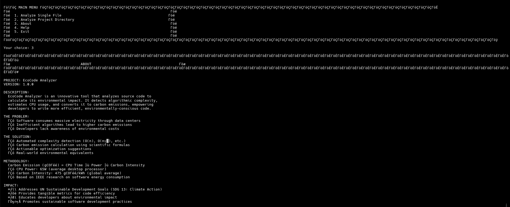
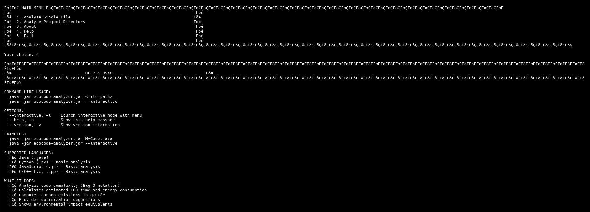

# 🌱 EcoCode Analyzer

> **Carbon Footprint Analysis for Source Code**  
> *Making software environmentally conscious, one line at a time.*

[](https://www.oracle.com/java/)
[](https://maven.apache.org/)
[](LICENSE)

---

## 📋 Table of Contents

- [Overview](#overview)
- [The Problem](#the-problem)
- [The Solution](#the-solution)
- [Features](#features)
- [Technologies Used](#technologies-used)
- [Installation & Setup](#installation--setup)
- [Usage](#usage)
- [How It Works](#how-it-works)
- [Sample Output](#sample-output)
- [Project Structure](#project-structure)
- [Testing](#testing)
- [Future Enhancements](#future-enhancements)
- [Contributing](#contributing)

---

## 🌍 Overview

**EcoCode Analyzer** is an innovative static code analysis tool that evaluates the **environmental impact** of software by:
- Analyzing source code complexity
- Detecting algorithms and calculating time complexity (Big O notation)
- Estimating CPU usage and execution time
- **Computing carbon emission scores** in grams of CO₂
- Providing actionable optimization suggestions to reduce environmental impact

This project addresses the growing concern of software's carbon footprint in an era of climate crisis.

---

## ⚠️ The Problem

### Software's Hidden Environmental Cost

1. **Energy Consumption**: Software runs on servers and devices that consume massive amounts of electricity
2. **Inefficient Algorithms**: Algorithms with poor time complexity (like O(n²) or O(2^n)) require exponentially more CPU cycles
3. **Carbon Emissions**: More CPU usage = higher energy consumption = more carbon emissions
4. **Lack of Awareness**: Developers rarely know the environmental cost of their code

**Statistics:**
- Data centers consume **1% of global electricity**
- Software inefficiency contributes to **unnecessary carbon emissions**
- A single inefficient algorithm running millions of times can emit **kilograms of CO₂**

---

## ✅ The Solution

EcoCode Analyzer provides developers with:

1. **Automated Complexity Detection**: Analyzes loops, recursion, and algorithm patterns
2. **Carbon Emission Calculation**: Converts computational cost to environmental impact
3. **Optimization Suggestions**: Actionable recommendations with potential carbon savings
4. **Environmental Metrics**: Real-world equivalents (e.g., "equivalent to driving 150 meters")
5. **Historical Tracking**: Monitor improvements over time

---

## ✨ Features

### Core Functionality

- ✅ **Multi-Language Support**: Java (full), Python, JavaScript, C/C++ (basic)
- ✅ **Complexity Detection**: Automatic Big O analysis (O(1), O(log n), O(n), O(n²), O(n³), O(2^n))
- ✅ **Carbon Calculation**: Scientific formula-based emission estimation
- ✅ **Pattern Recognition**: Detects sorting, searching, and recursive algorithms
- ✅ **Optimization Engine**: Suggests improvements with savings calculations
- ✅ **Environmental Equivalents**: Converts emissions to driving distance, tree absorption, etc.

### Analysis Capabilities

- 📊 Function-level complexity analysis
- 📈 Project-wide carbon footprint
- 🎯 Hotspot identification (worst functions)
- 💡 Priority-ranked suggestions (Low, Medium, High, Critical)
- 📋 Detailed reports with color-coded output

---

## 🛠️ Technologies Used

| Technology | Purpose |
|------------|---------|
| **Java 17** | Core programming language |
| **Maven** | Build and dependency management |
| **JavaParser** | Parsing Java source code into AST |
| **ANTLR 4** | Multi-language grammar support |
| **SQLite** | Embedded database for analysis history |
| **Gson** | JSON processing for data files |
| **JUnit 5** | Unit testing framework |
| **Jansi** | ANSI colors for terminal output |

---

## 📦 Installation & Setup

### Prerequisites

- **Java 17** or higher ([Download](https://www.oracle.com/java/technologies/downloads/))
- **Maven 3.8** or higher ([Download](https://maven.apache.org/download.cgi))
- Git (optional, for cloning)

### Steps

1. **Clone or Download the Project**
   ```bash
   git clone <repository-url>
   cd VITyarthi_Java
   ```

2. **Build the Project**
   ```bash
   mvn clean package
   ```

3. **Run the Application**
   ```bash
   # Interactive mode
   java -jar target/ecocode-analyzer.jar --interactive

   # Analyze a specific file
   java -jar target/ecocode-analyzer.jar path/to/YourCode.java
   ```

---

## 🚀 Usage

### Command-Line Options

```bash
# Interactive mode with menu
java -jar ecocode-analyzer.jar --interactive

# Analyze a single file
java -jar ecocode-analyzer.jar MyCode.java

# Show help
java -jar ecocode-analyzer.jar --help

# Show version
java -jar ecocode-analyzer.jar --version
```

### Interactive Mode

When you run in interactive mode, you'll see a menu:

```
┌─ MAIN MENU ─────────────────────────────────────┐
│                                                  │
│  1. Analyze Single File                         │
│  2. Analyze Project Directory                   │
│  3. About                                        │
│  4. Help                                         │
│  5. Exit                                         │
│                                                  │
└──────────────────────────────────────────────────┘
```

### Example: Analyzing a File

```bash
java -jar ecocode-analyzer.jar src/main/resources/sample-code/BubbleSort.java
```

---

## 🔬 How It Works

### 1. Code Parsing

- Uses **JavaParser** to build Abstract Syntax Tree (AST)
- Identifies functions, loops, conditionals, and recursive calls

### 2. Complexity Detection

```
Detection Methods:
├── Loop Nesting Analysis (O(n), O(n²), O(n³))
├── Recursion Pattern Matching (O(2^n), O(n!))
├── Divide-and-Conquer Detection (O(n log n))
└── Known Algorithm Recognition (Sorting, Searching)
```

### 3. Carbon Emission Calculation

**Scientific Formula:**

```
Carbon Emission (gCO₂) = CPU Time × Power Consumption × Carbon Intensity

Where:
- CPU Time = f(complexity, input_size) in seconds
- Power Consumption = 65W (average desktop CPU)
- Carbon Intensity = 475 gCO₂/kWh (global average)
```

**Detailed Steps:**

1. **Estimate Operations**: Based on Big O notation
   - O(n) with n=1000 → 1000 operations
   - O(n²) with n=1000 → 1,000,000 operations

2. **Calculate CPU Cycles**:
   ```
   cycles = operations × base_instructions / instructions_per_cycle
   ```

3. **Calculate Execution Time**:
   ```
   time_seconds = cycles / (CPU_frequency_GHz × 10^9)
   ```

4. **Calculate Energy**:
   ```
   energy_Wh = CPU_power_W × time_hours
   ```

5. **Calculate Carbon**:
   ```
   carbon_grams = energy_Wh × carbon_intensity / 1000
   ```

### 4. Optimization Suggestions

The engine detects patterns like:
- Nested loops → Suggest HashMaps for O(1) lookup
- Inefficient sorting → Suggest QuickSort/MergeSort
- Recursive Fibonacci → Suggest dynamic programming
- Linear search in sorted data → Suggest binary search

---

## 📊 Sample Output

### Analyzing BubbleSort.java

```
╔═══════════════════════════════════════════════════════════════════════════════╗
║                  EcoCode Analyzer - Carbon Emission Report                    ║
╚═══════════════════════════════════════════════════════════════════════════════╝

File: BubbleSort.java
Analysis Date: 2024-01-20T15:30:00

┌─ Overall Carbon Footprint ────────────────────────────────────
🚨 Total Carbon Emissions: 12.3456 gCO₂
Total Estimated Time: 1250.50 ms
Rating: Poor ⭐⭐

┌─ Environmental Impact Equivalents ────────────────────────────
🚗 Driving: 102.8 meters
🌳 Trees needed: 0.00059 tree-years
📱 Smartphone charges: 1.5 charges
   Moderate environmental impact - Room for optimization 🌍

┌─ Function-Level Analysis ─────────────────────────────────────
Function                  Time Complexity  Carbon (gCO₂)   Time (ms)
────────────────────────────────────────────────────────────────────
bubbleSort               O(n²)            12.2345         1248.20
printArray               O(n)             0.0811          2.30

⚠️  Hotspot: bubbleSort has the highest carbon emissions

┌─ Optimization Suggestions ────────────────────────────────────
🚨 Suggestion #1 - High Priority
  Function: bubbleSort
  Type: ALGORITHM_REPLACEMENT
  Description: Inefficient sorting algorithm detected. Use QuickSort or Arrays.sort()
  ❌ Current: O(n²)
  ✅ Suggested: O(n log n)
  💰 Potential Savings: 11.2348 gCO₂ (91.2% reduction)
```

---

## 📁 Project Structure

```
VITyarthi_Java/
├── src/
│   ├── main/
│   │   ├── java/com/ecocode/
│   │   │   ├── Main.java                      # Entry point
│   │   │   ├── core/
│   │   │   │   ├── CodeAnalyzer.java         # Main orchestrator
│   │   │   │   ├── ComplexityDetector.java   # Complexity analysis
│   │   │   │   ├── CarbonCalculator.java     # Emission calculation
│   │   │   │   └── OptimizationEngine.java   # Suggestions generator
│   │   │   ├── models/
│   │   │   │   ├── Complexity.java           # Big O enum
│   │   │   │   ├── ComplexityResult.java     # Analysis result
│   │   │   │   ├── CarbonReport.java         # Complete report
│   │   │   │   ├── FunctionAnalysis.java     # Per-function metrics
│   │   │   │   ├── OptimizationSuggestion.java
│   │   │   │   ├── EnvironmentalMetrics.java
│   │   │   │   └── CodeFile.java
│   │   │   └── ui/
│   │   │       └── ReportFormatter.java      # Console output formatter
│   │   └── resources/
│   │       └── sample-code/                   # Test files
│   │           ├── BubbleSort.java
│   │           ├── Fibonacci.java
│   │           └── BinarySearch.java
│   └── test/java/                             # Unit tests
├── docs/
│   ├── diagrams/                              # UML diagrams
│   └── report/                                # Project report
├── statement.md                               # Problem statement
├── README.md                                  # This file
└── pom.xml                                    # Maven configuration
```

---

## 🧪 Testing

### Run Unit Tests

```bash
mvn test
```

### Test with Sample Files

```bash
# Test with inefficient code (O(n²))
java -jar target/ecocode-analyzer.jar src/main/resources/sample-code/BubbleSort.java

# Test with exponential code (O(2^n))
java -jar target/ecocode-analyzer.jar src/main/resources/sample-code/Fibonacci.java

# Test with efficient code (O(log n))
java -jar target/ecocode-analyzer.jar src/main/resources/sample-code/BinarySearch.java
```

### Expected Behavior

| Test File | Expected Complexity | Expected Rating | Should Suggest |
|-----------|-------------------|-----------------|----------------|
| BubbleSort.java | O(n²) | Poor | ✅ Use QuickSort |
| Fibonacci.java | O(2^n) | Very Poor | ✅ Use DP/Memoization |
| BinarySearch.java | O(log n) | Excellent | ❌ Already optimal |

---

## 🚀 Future Enhancements

### Phase 2
- [ ] Full Python/JavaScript/C++ parser implementation
- [ ] IDE plugins (IntelliJ IDEA, VS Code, Eclipse)
- [ ] Real-time analysis during coding
- [ ] CI/CD integration (GitHub Actions, GitLab CI)

### Phase 3
- [ ] Machine learning for advanced pattern detection
- [ ] Web-based dashboard with charts
- [ ] Team analytics and leaderboards
- [ ] Carbon offsetting integration

### Phase 4
- [ ] Research paper publication
- [ ] Open-source community building
- [ ] Industry partnerships
- [ ] Green software certification program

---

## 📜 License

This project is developed for educational purposes as part of the VITyarthi project.

---

## Screenshots
Result-->

1. Analyze Single File  


2. About


3. Help


<div align="center">

**Making Software Greener, One Line at a Time** 🌱

*Built with ❤️ for a sustainable future*

</div>
